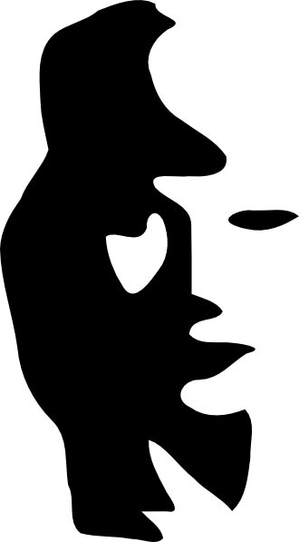

# Markdown

Some quick markdown examples.


## Strike Through

Here is a sentance ~~with~~ a word striked out

## Some links

* <http://www.google.com>
* <http://www.gmail.com>
* <http://www.youtube.com>
* [My github account](http://www.github.com/jonheine)
* [My github account][1]
* [the video site][youtube]

## Images


[](images/saxophonewoman.jpg)

## Lists

+ List item
+ List item 2

1. List item
1. List item 2

* List item
* List item 2


## Check Boxes
* [x] Get a puppy
* [ ] Smoke a doobie
* [ ] Surf a wave


## Horizontal rule

---

This is separated from

----

equal signs should work but the do not with grip at least.

===  


## Block Quotes


> Here are some block quotes
> just in case you want to get fancy

## Code highlighting

Main Function

```C
int main(int argc, arg** argv) {
   printf("Hello World\n");
   return 0;
}
```

hey did you try `i += 2`?

```diff
int i = 100;
- int j = 200;
+ int j = 250;
```


## Tables

|X|Y|Z|
|:---------:|:-------:|:-------:|
|10.0|21.4|25.0|
|15.0|20.4|20.0|
|20.0|15.4|30.0|


|Left Aligned|Right Aligned|Center Aligned|
|:---------|-------:|:-------:|
|10.0|21.4|25.0|


[1]: http://www.github.com/jonheine
[youtube]: http://www.youtube.com
[sax]: images/saxophonewoman.jpg

